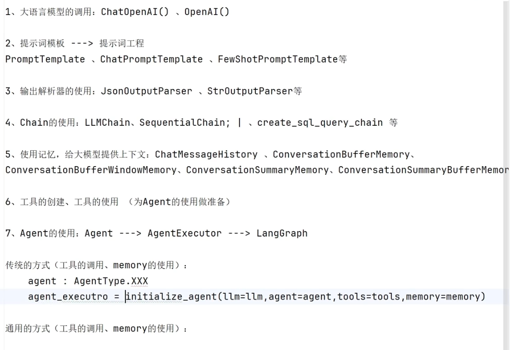
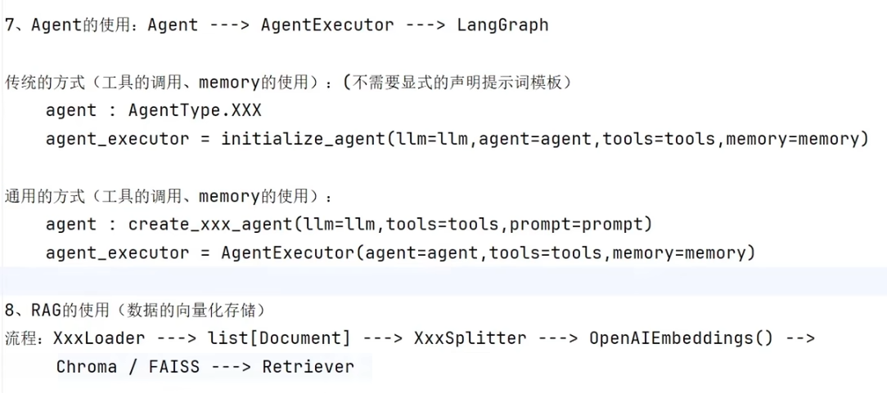

# langchain-tutorials
尚硅谷langchain课程代码整理
课程链接：【尚硅谷LangChain教程，langchain实战快速入门】 https://www.bilibili.com/video/BV1ZppNzHEY4/?share_source=copy_web&vd_source=20485980e219f6daf342d7f60756d2a4

# 准备
安装Ollama，创建AI API账号(课程使用CloseAI)，安装python各种依赖(见视频)。

# 视频复习笔记

